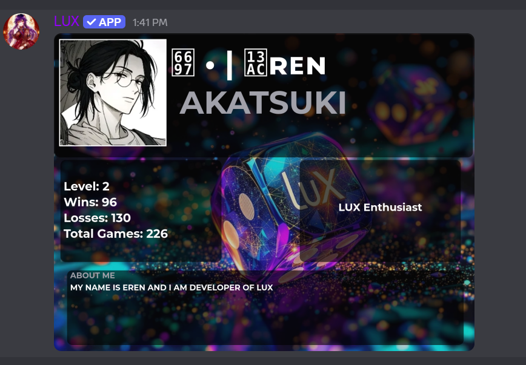
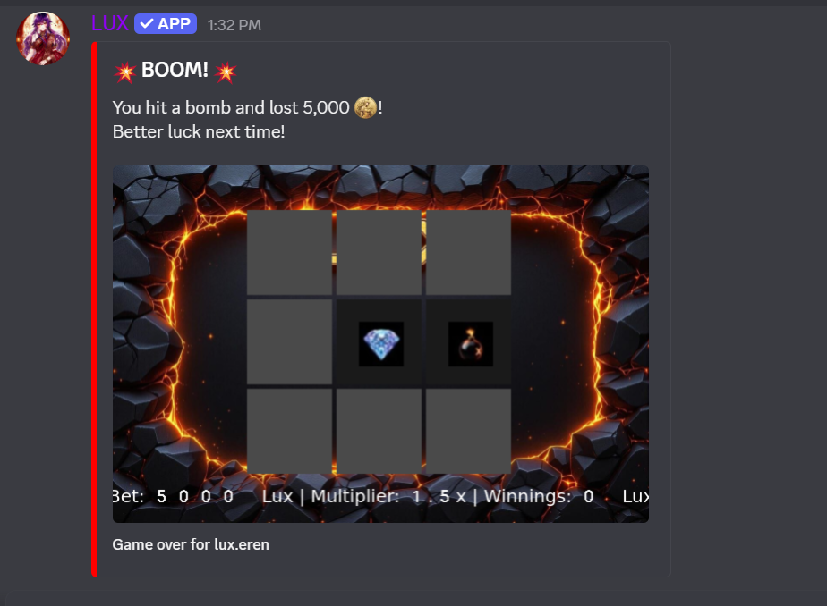

<div align="center">

# LUXBOT

### Discord Economy Bot with gambling, stocks, casinos, quests, crates, and more

<p>
	
	
	
</p>

<p>
	<a href="https://discord.gg/8y2uvFcCYT">Support Server</a> •
	<a href="https://www.youtube.com/@Code-Nestexe">YouTube</a>
</p>

</div>

## Overview

LUXBOT is a full economy bot built for Discord communities. It includes a currency system, stock trading, casinos, quests, fishing, mining, crates, leaderboards, moderation tools, and a custom emoji-driven experience.

If you like this repo, please leave a star. I also make paid bots, so if you want a custom build, contact me on Discord: `@lux.eren`.

## Features

- Economy: balance, bank, transfers, donations, daily rewards
- Gambling: coinflip, slots, mine, horserace
- Trading: stocks, portfolios, charting, auto-buy and auto-sell
- Casino tools: create, manage, invite, promote, demote, bank, drop
- Progression: XP, levels, quests, collectibles
- Rewards: daily crates, vote crates, special items, fishing loot
- Moderation: ban system, channel disable/enable, admin utilities
- Slash commands: `/` support is enabled alongside prefix commands
- Custom emojis: optional emoji sync on first launch when enabled

## Installation

This bot is set up for VPS, Pterodactyl, or Docker-style hosting.

1. Download the project zip.
2. Upload it to your hosting panel and unarchive it.
3. Fill in your `.env` file.
4. Set the startup command to `src/index.js`.
5. Start the bot and enjoy.

### VPS Installation

If you are using a VPS, the setup is just as simple:

1. Download or clone the project on your VPS.
2. Install dependencies with `npm install`.
3. Fill in your `.env` file with the latest values.
4. Set your start command to `node src/index.js` or `npm start`.
5. Run the bot and enjoy.

### Environment File

Use the latest `.env` keys below:

```dotenv
TOKEN=your_bot_token_here
MONGODB_URI=your_mongodb_uri_here
BOT_OWNER_ID=your_owner_id_here
ADMIN_IDS=your_admin_ids_here
PREFIX=your_prefix_here
SYNC_EMOJI=false
TOPGG_TOKEN=your_topgg_token_here
TOPGG_WEBHOOK_PASSWORD=your_webhook_password_here
TOPGG_WEBHOOK_PORT=your_webhook_port_here
```

Optional behavior flags:

- `SYNC_EMOJI=false` by default. Set it to `true` if you want the bot to sync the custom emojis used in this repo into target guilds on first launch.

## Commands

The bot supports both prefix and slash usage for the core command set.

### Common Economy Commands

- `/cash` or `X cash` - check balance
- `/bank` or `X bank` - manage bank
- `/give` or `X give` - transfer Lux
- `/daily` or `X daily` - claim the daily reward
- `/inventory` or `X inventory` - view items
- `/profile` or `X profile` - view player profile

### Games and Trading

- `/coinflip` or `X coinflip` - play coinflip
- `/mine` or `X mine` - play the mine game
- `/slot` or `X slot` - play slots
- `/horserace` or `X horserace` - join a race
- `/stocks` or `X stocks` - view the market
- `/buystock` or `X buystock` - buy stock
- `/sellstock` or `X sellstock` - sell stock

### Management

- `/casino` or `X casino` - casino management
- `/quest` or `X quest` - quest progress
- `/leaderboard` or `X leaderboard` - rankings
- `/prefix` or `X prefix` - set the server prefix
- `/stocknotify` or `X stocknotify` - set stock alerts

## Screenshots

To add images in this README, place them in your repo and reference them with markdown image syntax.

Example:





You can also use a simple gallery:


| Bot Home | Economy Menu |
| --- | --- |
|  |  |


## Project Structure

```text
src/
├── commands/        All prefix and slash command modules
├── crates/          Crate reward definitions
├── events/          Event handlers
├── funcmds/         Fun commands
├── utils/           Helper utilities and image tools
├── assets/          Fonts, images, and visual assets
├── database.js      Core database access layer
└── ...              Domain-specific database modules
```

## Support

- Join the Discord server: https://discord.gg/8y2uvFcCYT
- YouTube: https://www.youtube.com/@Code-Nestexe
- Discord contact: `@lux.eren`

## Contributing

Pull requests are welcome. Please keep changes focused and consistent with the existing bot systems.

## License

Add your license here before publishing publicly.

